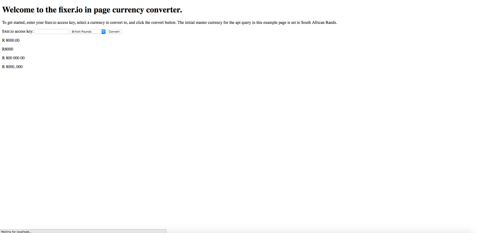

# fixer-io-in-page-currency-converter

> Convert instances of one currency to another, given a dom element to target

[![NPM Version][npm-image]][npm-url]
[![Build Status][travis-image]][travis-url]
[![Downloads Stats][npm-downloads]][npm-url]

This, given fixer.io API credentials, a master currency code and a source and target currency, as well as a DOM node, converts all instances it finds within that DOM node and its children from the source to the target currency, in page.



## Installation

```sh
npm install fixer-io-in-page-currency-converter --save
```

## Usage example

The easiest way to use this library is to include dist/bundle.js in your page, and then instantiate the library with:

```js
var currencyConverter = new FixerIoInPageCurrencyConversion.Converter({
    masterCurrencyCode: 'ZAR',
    accessKey: 'your-fixer-access-key-here',
    cacheSeconds: 300,
    decimalPoints: 0,
});

var currentCurrencyCode = "ZAR";
var currencyToConvertToCode = "GBP";


currencyConverter.getCurrencyRates().then(function (currencyRates) {
    currencyConverter.setCurrencyRates(currencyRates);
    currencyConverter.replaceCurrencyInstancesInNode(
        document.body,
        currentCurrencyCode,
        currencyToConvertToCode
    ).then(function(result) {
        if(result) {
            // update the currently selected currency, store in localStorage etc.
        }
    });
});
```

## Development setup

* Run ```sh npm install```
* To run the test suite run ```sh npm run test```
* For a development build of the library run ```sh npm run develop```.
* For a development version of the library with hot reloading and served via webpack-dev-server run ```sh npm run serve```

## Release History

* 0.0.1
  * Work in progress

## Meta

Jonathan Arnold – jon@mixnblend.com

Distributed under the ISC license. See [ISC License](https://choosealicense.com/licenses/isc/) for more information.

[https://github.com/jonmixnblend](https://github.com/jonmixnblend)

## Contribute

1. Fork it (<https://github.com/jonmixnblend/fixerio-in-page-currency-conversion/fork>)
2. Create your feature branch (`git checkout -b feature/FeatureName`)
3. Commit your changes (`git commit -am 'Add some FeatureName'`)
4. Push to the branch (`git push origin feature/FeatureName`)
5. Create a new Pull Request

<!-- Markdown link & img dfn's -->
[npm-image]:
[npm-url]:
[npm-downloads]:
[travis-image]:
[travis-url]: